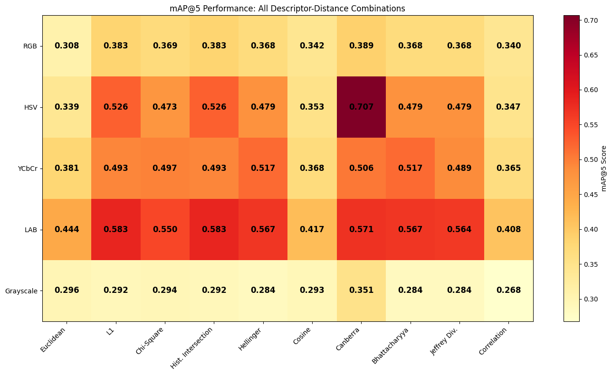
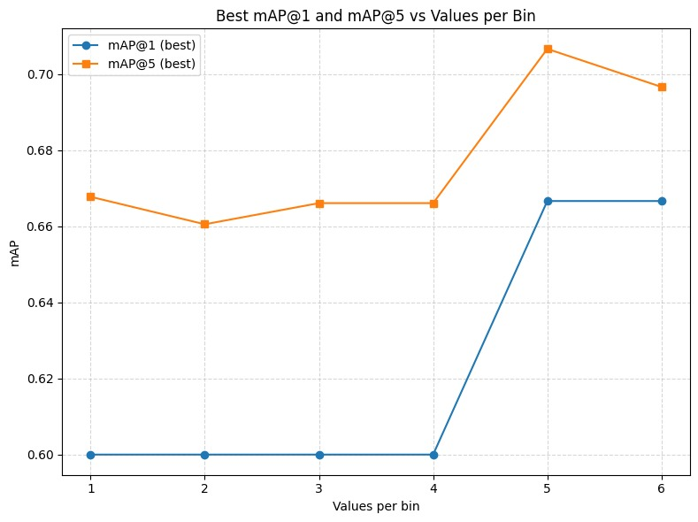

# Content-Based Image Retrieval

This project implements a **query-by-example image retrieval system** designed to find paintings in the *Can Framis Museum*, *Figueres 120 years ago* and *Kode Bergen* image collection based on their **visual content**.  

Developed by **Team 5** as part of the **C1 – Content Based Image Retrieval** course assignment at the *Master’s in Computer Vision (UPC-CVC)*, academic year 2025-2026.


## Overview
This project implements a Content-Based Image Retrieval system designed to search paintings in the museums dataset based on color, texture, and local descriptors.
The goal is to explore classical and modern feature extraction techniques for visual similarity search.

The following diagram illustrates the CBIR workflow implemented in this project.
<p align="center">  </p>

To learn more about the experimentation process and the choice of optimal parameters, see the [Methodology](#methodology) section.


## Pipeline steps:

1. **Indexing the database.** Compute and store color histograms for all database images (performed offline).

2. **Background removal.** Use color to remove the background of the query images.

3. **Feature extraction for query images.** Compute the same descriptor type used for the database for each query image only on the foreground pixels.

4. **Similarity computation.** Compare query descriptors with the database using distance metrics.

5. **Ranking and retrieval.** Sort database images according to similarity and return the top-k most visually similar paintings.

## Features

- **Background Removal:** Automatically segments the painting from its background using robust color statistics and morphological filtering.  

- **Multiple Image Descriptors:** Extract diverse visual representations capturing color, texture, and spatial information.  
  - Grayscale Histogram
  - RGB Histogram
  - HSV Histogram
  - YCbCr Histogram
  - LAB Histogram
  - 2 Dimension Histogram
  - 3 Dimension Histogram
  - Block-based Histogram
  - Spatial Pyramid Histogram

- **Multiple Distance Metrics:** Measures similarity between images using diverse statistical and geometric criteria.
  - Euclidean Distance
  - L1 (Manhattan) Distance
  - Chi-Squared Distance
  - Histogram Intersection
  - Hellinger Distance
  - Cosine Distance
  - Canberra Distance
  - Bhattacharyya Distance
  - Jensen-Shannon Divergence
  - Correlation Distance

- **Evaluation Metrics:** Quantifies retrieval effectiveness and ranking quality.  
  - Mean Average Precision at K (mAP@K)
  - Top-K retrieval accuracy

- **Visualization:** Provides intuitive insight into system performance and retrieval quality.
  - Heatmaps for comprehensive evaluation
  - Query-retrieval result visualizations


## Project Organization

The project follows a modular and reproducible structure, inspired by the cookiecutter data science template. Each folder has a clear purpose to ensure scalability and team collaboration.

```
├── Makefile           <- Makefile with convenience commands
├── README.md          <- The top-level README for developers using this project.
├── data
│   ├── raw            <- The original, immutable data dump.
│   ├── segmented      <- The segmented dataset after applying background removal.
│   ├── descriptors    <- Descriptors extracted from images ready to use for retrieval.
│   └── results        <- Results obtained from executing the retrieval.
│
├── models             <- Trained and serialized models, model predictions, or model summaries
│
├── notebooks/         <- Jupyter notebooks.
│
├── reports            <- Generated analysis as HTML, PDF, LaTeX, etc.
│   └── figures        <- Generated graphics and figures to be used in reporting
│
├── requirements.txt   <- The requirements file for reproducing the analysis environment, e.g.
│
└── src   <- Source code for use in this project.
    ├── __init__.py             <- Makes src a Python module
    ├── config.py               <- Store useful variables and configuration
    ├── data/                   <- Scripts to extract/load data
    ├── descriptors/            <- Scripts to compute image descriptors
    ├── distances/              <- Scripts to compute distance measures
    ├── metrics/                <- Scripts to compute metrics
    ├── models/                 <- Scripts to compute image retrieval and generate deliverables
    ├── tools/                  <- Helper functions
    └── visualization/          <- Code to create visualizations
```

--------

## Installation

#### Clone the repository
``` bash
git clone https://github.com/MCV-2025-C1-Project/Team5.git
cd Team5
```

#### Create and activate virtual environment
It’s recommended to use a virtual environment to avoid dependency conflicts.
```bash
python -m venv .venv
source .venv/bin/activate
```

#### Install dependencies
```bash
pip install -r requirements.txt
```

#### Add dataset files

Place the datasets in the `data/raw/` folder as follows:
```
├── data
    └── raw
        ├──BBDD/            <- Database of paintings
        ├──qsd1_w1/         <- Query set for week 1 development
        ├──qsd2_w2/         <- Query set for week 2 development
        ├──qst1_w1/         <- Query set for week 1 testing
        └──qst_w2/          <- Query set for week 2 testing
```


## Usage

Once the environment and data are set up, you can execute the pipeline to perform image retrieval.


### 1. Remove background

<!---#### To execute manually--->

The background segmentation module removes non-artwork regions using robust color-based analysis in LAB and HSV spaces, isolating the painting for cleaner descriptor extraction and retrieval.

**Example command**

```bash
python -m src.models.seg
```

This command processes all images in the default dataset folder, producing:
- Binary foreground masks
- Segmented (background-removed) images
- Visualizations and performance metrics (if ground truth is available)
- Outputs are stored under `data/segmented/`.

| Parameter | Description |
|------------|-------------|
| `--image_folder` | Path to the input dataset folder (default: `data/raw/qsd2_w2/`). |
| `--output_folder` | Directory where segmented images, masks, and visualizations will be saved (default: `data/segmented/`). |
| `--max_images` | Maximum number of images to process (optional; processes all by default). |

Run `python -m src.models.seg --help` to see all available options.


### 2. Index the database

The descriptor computator module automates the extraction of global color descriptors for all images in a given dataset folder. It forms the first stage of the CBIR pipeline, generating a numerical representation for each image based on its color distribution.

**Workflow**

1. **Load images** from the specified dataset folder.
2. **Compute histograms** using the chosen descriptor.
3. **Aggregate and serialize** all image descriptors into a single .pkl file under data/descriptors/.

<!---
#### To execute automatically

For convenience, the project includes a **Makefile** that automates the execution of the main stages of the pipeline. You can simply run:

```bash
make descriptors
```


> 💡 % TODO: update This command computes all descriptors in the HSV and LAB color spaces with a bin size of 5, which are the best configuration found during experimentation, for both the Museum and Query datasets.  

#### To execute manually

If it is desired to set different hyperparameter configurations, it is also possible to execute manually using a simple command.--->

**Key Features**

- Supports multiple color spaces: Grayscale, RGB, HSV, Lab, and YCbCr.
- Supports agregation of consecutive values of the histogram in the same bin.
- Supports color representation as 2D and 3D histograms.
- Supports spatial structure influence by computing histograms by block or as a spatial pyramid.
- Automatically loads all .jpg or .jpeg images from the input folder.
- Stores computed descriptors and metadata in a single .pkl file for later use in retrieval and evaluation.


**Example command**

To process the museum's database:

``` bash
python -m src.descriptors.compute_descriptors \
    --descriptor spatial_pyramid_hsv_lvl4 \
    --input data/raw/BBDD \
    --outdir data/descriptors \
    --values_per_bin 5
```

This process must be done to query datasets as well, example command:

To process the raw images (1st week case):

``` bash
python -m src.descriptors.compute_descriptors \
    --descriptor spatial_pyramid_hsv_lvl4 \
    --input data/raw/qsd1_w1 \
    --outdir data/descriptors/w1 \
    --values_per_bin 5
```

To process the segmented images with the background removed (2nd week case):

``` bash
python -m src.descriptors.compute_descriptors \
    --descriptor spatial_pyramid_hsv_lvl4 \
    --input data/raw/qsd2_w2 \
    --outdir data/descriptors/w2 \
    --values_per_bin 8
```

**Command-Line Arguments**

| Parameter | Description |
|------------|-------------|
| `--descriptor` | Descriptor or color space type. |
| `--input` | Path to the dataset folder containing the images. |
| `--outdir` | Directory where the computed `.pkl` descriptor files will be saved. |
| `--values_per_bin` | Number of intensity values per histogram bin (controls descriptor granularity). |


Run `python -m src.descriptors.compute_descriptors --help` to see all available options.

### 3. Find matching


Once the descriptors for both the **query dataset** and the **museum database** are generated, this step performs the **retrieval phase** — comparing the query descriptors against all database descriptors to find the most visually similar paintings.

For each query image, the script:
1. Loads precomputed descriptors from `.pkl` files.
2. Computes pairwise distances or similarities using the selected metric.
3. Retrieves the top-*K* database images with the smallest (or most similar) distance scores.
4. Saves the ranked results as a `.pkl` file inside the output directory.

**Supported Metrics**

The retrieval system supports multiple distance and similarity metrics, allowing flexible experimentation:

| Metric | Description |
|---------|-------------|
| `bhattacharyya` | Statistical distance between probability distributions. |
| `canberra` | Weighted version of the Manhattan distance. |
| `chi_2` | Measures dissimilarity between two histograms. |
| `l1` | Manhattan (city-block) distance. |
| `correlation` | Measures correlation-based similarity between histograms. |
| `js_divergence` | Symmetric and smoothed version of Kullback–Leibler divergence. |
| `intersection` | Histogram intersection similarity. |
| `hellinger` | Measures distance between normalized distributions. |
| `euclidean` | Standard L2 distance. |
| `cosine` | Cosine similarity between feature vectors. |


<!---
#### To execute automatically

Once the descriptors are created, you can run the **retrieval stage** to find the most visually similar paintings between the **query** and **museum** datasets.

You can execute all retrieval experiments automatically using:


```bash
make find_matching
```

#### To execute manually
--->


**Example command**

```bash
python -m src.models.find_matches \
    data/descriptors/qsd1_w1_hsv_vpb5.pkl \
    data/descriptors/BBDD_hsv_vpb5.pkl \
    --metric canberra \
    --k 10 \
    --outdir data/results
```

This command retrieves the 10 most similar paintings from the museum database for each query image using the Canberra distance, and saves the ranked results in `data/results`.

**Command-Line Arguments**

Run `python -m src.descriptors.find_matches --help` to see all available options.

**Output format**

A .pkl file storing, for each query image, the list of top-K most similar database image IDs.

```python
[
    [23, 45, 11, 7, 38, 9, 27, 56, 18, 40],  # Top-10 matches for Query 1
    [4, 29, 33, 20, 8, 15, 6, 17, 1, 43],    # Top-10 matches for Query 2
    ...
]
```

### 4. Evaluate descriptors and distances

To evaluate with the 1st week's dataset:

```bash
python -m src.models.run \
    --query_dir data/raw/qsd1_w1 \
    --museum_dir data/raw/BBDD \
    --ground_truth data/raw/qsd1_w1/gt_corresps.pkl \
    --values_per_bin 8 \
    --output_dir results/w1 \
    --k 5 \
    --descriptors spatial_pyramid_hsv_lvl4 \
    --distances canberra.canberra_distance
```

To evaluate with the 2nd week's dataset:

```bash
python -m src.models.run \
    --query_dir data/raw/qsd2_w2 \
    --museum_dir data/raw/BBDD \
    --ground_truth data/raw/qsd2_w2/gt_corresps.pkl \
    --values_per_bin 8 \
    --output_dir results/w2 \
    --k 5 \
    --descriptors spatial_pyramid_hsv_lvl4 \
    --distances canberra.canberra_distance
```

#### Hyperparameters

The main hyperparameters can be configured when running descriptor extraction or retrieval scripts:

| Parameter | Description |
|-----------|-------------|
| `--query_dir` | Directory containing query images. |
| `--museum_dir` | Directory containing museum (database) images. |
| `--ground_truth` | Path to the ground truth file (for evaluation). |
| `--values_per_bin` | Number of intensity values per histogram bin (controls descriptor granularity). |
| `--output_dir` | Directory where descriptors or results will be saved. |
| `--k` | Number of top results to retrieve per query. |
| `--descriptors` | Descriptor type(s) or color space(s) to use. |
| `--distances` | Distance metric(s) used to compare descriptors. |

Run `python -m src.models.run --help` to see all available options.


**Metrics Explanation**
- **mAP@1**: Mean Average Precision considering only the top-1 retrieved image
- **mAP@5**: Mean Average Precision considering top-5 retrieved images
- Higher values are better (range: 0.0 to 1.0)


## Methodology

### Week 1

The first milestone focuses on global color-based image retrieval, using single-resolution color histograms as visual descriptors. Color histograms are one of the simplest and most intuitive ways to represent an image, summarizing the distribution of pixel colors and enabling comparisons through distance metrics

The first week we computed and tested different 1D histogram-based descriptors by systematically varying the colour space and the bin resolution, and compared these combinations to identify the most discriminative representation for accurate similarity and retrieval in later tasks.

Another goal was to measure and quantify the similarity between images by comparing their feature descriptors using a variety of distance and similarity metrics. And we did that by computing different similarity/distance measures on image descriptors, and systematically evaluate their behavior to identify which metrics best capture perceptual similarity

We performed a grid search experimentation combining 5 different color spaces histograms as descriptors: grayscale, concatenated RGB, concatenated HSV, concatenated LAB, and concatenated YCbCr; a range of different values for the bin size starting from one bin for each value and increasing it; and 10 different distances: Euclidean, L1, Chi-squared, Cosine, Hellinger, Correlatino, Canberra, Bhattacharyya, Histogram intersection, and Jensen-Shannon divergence. 

For each descriptor/bin setting, we computed distances between each query image and all images in the BBDD with all candidate metrics. And for each descriptor/bin/metric combination, we computed retrieval metrics such as mAP@1 and mAP@5 on the query set (QSD1 vs. BBDD), compared with the provided ground truths, and visualised the results with heatmaps per bin setting.

That way we found that the best performing bin size is 52, the best descriptors are the LAB and HSV concatenated histograms, and the best performing distance is the Canberra.

<p align="center">   </p>

> 💡 Detailed experiments results can be found [here](https://drive.google.com/file/d/1xAyKrl3MnFGKuZpDm2FUu5bInHqnu2BU/view?usp=sharing)

### Week 2

During the second week of the project, we had 2 goals. From one hand, **enhancing image representation by combining color and spatial information**, creating more discriminative descriptors for image retrieval. We extended the classic color histogram approach by computing histograms not only over the whole image, but also over spatial regions and multiple pyramid levels. From the other hand, we wanted to **use color to remove the background of the images** to be able to compute the descriptors only on the foreground pixels.

#### Improving descriptors

To evaluate how color representation and spatial structure influence retrieval performance, we tested a variety of histogram descriptors in the HSV color space using the Canberra distance, as these were the best performing parameters selected from week 1. We explored 1D, 2D, and 3D histograms with increasing color dimensionality, and extended them with block-based and spatial pyramid variants to capture local and multi-scale information. For each setup, we experimented with different bin sizes, grid divisions, and pyramid levels to study the trade-off between descriptor detail and computational efficiency.

The best overall performance was achieved with the Spatial Pyramid Histogram (1D, HSV) using Level 4 and 32 bins, reaching
mAP@1 = 0.833 and mAP@5 = 0.883.

In contrast, 2D histograms (H–S) performed significantly worse — the best result (~0.50 mAP@5 with 16×16 bins) was even lower than our Week 1 baseline (mAP@1 = 0.667, mAP@5 = 0.707).
This suggests that removing the Value (V) channel discarded important brightness information that helps distinguish similar colors.

For 3D histograms, results did not surpass the 1D spatial pyramid either, although the 3D pyramid (Level 3) reached a moderate mAP@5 = 0.72.
We expected these descriptors (hierarchical vs. 3D) to perform better since they capture richer color relationships, but the higher dimensionality may have caused over-smoothing and loss of discriminative power, especially with limited data.

#### Removing background

The background removal module isolates the painting from its surroundings using robust color statistics in the LAB and HSV color spaces. The algorithm first estimates the background color by analyzing the image borders in LAB space, computing a robust median and deviation per channel. Each pixel’s distance to this background model is then calculated and thresholded adaptively based on the distribution of border distances. Pixels that deviate significantly from the background in color are classified as foreground.  

A hue-based fallback in HSV space detects additional foreground pixels whose hue differs strongly from the background, improving robustness to illumination changes. Finally, a sequence of morphological operations removes small artifacts, fills holes, and retains the main object region. The resulting binary mask is applied to the original image to produce a clean segmentation of the painting. Evaluating the generating masks with their ground truths pixel-wise, we obtained a precision of 0.94, a recall of 0.93 and an F1-score of 0.92.

#### Final pipeline

We built the final pipeline combining the background removal and used the best configuration for retrieval: 4-Level HSV Spatial Pyramid Histogram with 32 bins as a descriptor with Canberra distance.

We observed that background removal is generally successful, but leaves minor noise at painting borders. This segmentation noise leads to incorrect matches, degrading the metrics compared to the non-segmented version with the 1st dataset. Nonetheless, we reached a mAP@1 of 0.6667 and a mAP@5 of 0.7333.
 


## Team members:

- OREGI LAUZIRIKA, Lore - loreoregi@gmail.com
- ROSELL MURILLO, Marina - marrosmur@gmail.com
- ARTERO PONS, Marc - marteropons@gmail.com
- PURKAYASTHA, Kunal - kunalpurkayastha09@gmail.com
