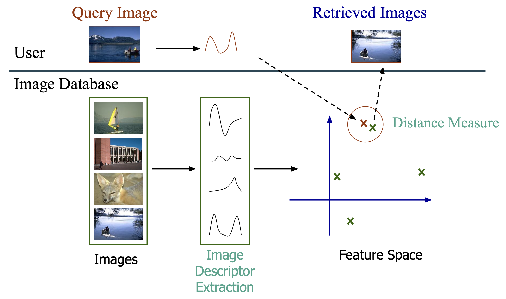

# Content-Based Image Retrieval (CBIR)

This project implements a **query-by-example image retrieval system** designed to find paintings in the *Can Framis Museum* image collection based on their **visual content**.  

Developed by **Team 5** as part of the **C1 – Content Based Image Retrieval** course assignment at the *Master’s in Computer Vision (UPC-CVC)*, academic year 2025-2026.


## Overview
This project implements a Content-Based Image Retrieval (CBIR) system designed to search paintings in the Can Framis Museum dataset based on color, texture, and local descriptors.
The goal is to explore classical and modern feature extraction techniques for visual similarity search.

The following diagram illustrates the CBIR workflow implemented in this project.
<p align="center">  </p>

## Week 1

The first milestone focuses on global color-based image retrieval, using single-resolution color histograms as visual descriptors.

Color histograms are one of the simplest and most intuitive ways to represent an image, summarizing the distribution of pixel colors and enabling comparisons through distance metrics

### Steps implemented:

1. **Indexing the database** Compute and store color histograms for all database images (performed offline).

2. **Feature extraction for query images**
Compute the same descriptor type for each query image.

3. **Similarity computation**
Compare query descriptors with the database using distance metrics.

4. **Ranking and retrieval**
Sort database images according to similarity and return the top-k most visually similar paintings.

### Features

- **Multiple Image Descriptors:**
  - Grayscale Histogram
  - RGB Histogram
  - HSV Histogram
  - YCbCr Histogram
  - LAB Histogram

- **Multiple Distance Metrics:**
  - Euclidean Distance
  - L1 (Manhattan) Distance
  - Chi-Squared Distance
  - Histogram Intersection
  - Hellinger Distance
  - Cosine Distance
  - Canberra Distance
  - Bhattacharyya Distance
  - Jensen-Shannon Divergence
  - Correlation Distance

- **Evaluation Metrics:**
  - Mean Average Precision at K (mAP@K)
  - Top-K retrieval accuracy

- **Visualization:**
  - Heatmaps for comprehensive evaluation
  - Query-retrieval result visualizations


## Project Organization

The project follows a modular and reproducible structure, inspired by the cookiecutter data science template. Each folder has a clear purpose to ensure scalability and team collaboration.

```
├── Makefile           <- Makefile with convenience commands like `make data` or `make train`
├── README.md          <- The top-level README for developers using this project.
├── data
│   ├── raw            <- The original, immutable data dump.
│   ├── descriptors    <- Descriptors extracted from images ready to use for retrieval.
│   └── results        <- Results obtained from executing the retrieval.
│
├── models             <- Trained and serialized models, model predictions, or model summaries
│
├── notebooks/         <- Jupyter notebooks.
│
├── pyproject.toml     <- Project configuration file with package metadata for 
│                         team5 and configuration for tools like black
│
├── references         <- Data dictionaries, manuals, and all other explanatory materials.
│
├── reports            <- Generated analysis as HTML, PDF, LaTeX, etc.
│   └── figures        <- Generated graphics and figures to be used in reporting
│
├── requirements.txt   <- The requirements file for reproducing the analysis environment, e.g.
│
└── src   <- Source code for use in this project.
    ├── __init__.py             <- Makes src a Python module
    ├── config.py               <- Store useful variables and configuration
    ├── data/                   <- Scripts to extract/load data
    ├── descriptors/            <- Scripts to compute image descriptors
    ├── distances/              <- Scripts to compute distance measures
    ├── metrics/                <- Scripts to compute metrics
    ├── models/                 <- Scripts to compute image retrieval and generate deliverables
    ├── tools/                  <- Helper functions
    └── visualization/          <- Code to create visualizations
```

--------

## Installation

#### Clone the repository
``` bash
git clone https://github.com/MCV-2025-C1-Project/Team5.git
cd Team5
```

#### Create and activate virtual environment
It’s recommended to use a virtual environment to avoid dependency conflicts.
```bash
python -m venv .venv
source .venv/bin/activate
```

#### Install dependencies
```bash
pip install -r requirements.txt
```

#### Add dataset files

Place the datasets in the `data/raw/` folder as follows:
```
├── data
    └── raw
        ├──BBDD/            <- Database of paintings
        ├──qsd1_w1/         <- Query set for week 1 development
        └──qst1_w1/         <- Query set for week 1 testing
```


## Usage

Once the environment and data are set up, you can execute the pipeline to perform image retrieval.


### 1. Index the database

The descriptor computator module automates the extraction of global color descriptors for all images in a given dataset folder. It forms the first stage of the CBIR pipeline, generating a numerical representation for each image based on its color distribution.

**Workflow**

1. **Load images** from the specified dataset folder (--input).
2. **Compute histograms** using the chosen descriptor (--descriptor).
3. **Aggregate and serialize** all image descriptors into a single .pkl file under data/descriptors/.

#### To execute automatically

#TODO makefile

If has been configured a Make command with the best hyperparameters set to simplify the computation of the descriptors. Just by executing:

```bash
make descriptors
```

#### To execute manually

If it is desired to set different hyperparameter configurations, it is also possible to execute manually using a simple command.

**Key Features**

- Supports multiple color spaces: Grayscale, RGB, HSV, Lab, and YCbCr.
- Supports agregation of consecutive values of the histogram in the same bin
- Allows configurable histogram binning through the values_per_bin argument.
- Automatically loads all .jpg or .jpeg images from the input folder.
- Stores computed descriptors and metadata in a single .pkl file for later use in retrieval and evaluation.


**Example command**

``` bash
python -m src.descriptors.compute_descriptors \
    --descriptor hsv \
    --input data/raw/BBDD \
    --outdir data/descriptors \
    --values_per_bin 5
```

This process must be done to query datasets as well, example command:

``` bash
python -m src.descriptors.compute_descriptors \
    --descriptor hsv \
    --input data/raw/qsd1_w1 \
    --outdir data/descriptors \
    --values_per_bin 5
```

**Command-Line Arguments**

Run `python -m src.descriptors.compute_descriptors --help` to see all available options:

```
usage: compute_descriptors.py [-h] --descriptor {grayscale,hsv,lab,rgb,ycbcr} --input INPUT [--outdir OUTDIR] [--values_per_bin VALUES_PER_BIN]

Compute 1D image descriptors.

options:
  -h, --help            show this help message and exit
  --descriptor {grayscale,hsv,lab,rgb,ycbcr}
                        Which descriptor to run: grayscale | hsv | lab | rgb | ycbcr
  --input INPUT         Folder with images (BBDD, QSD1, QST1)
  --outdir OUTDIR       Output folder
  --values_per_bin VALUES_PER_BIN
                        Intensity values per bin
```


### 2. Find matching


Once the descriptors for both the **query dataset** and the **museum database** are generated, this step performs the **retrieval phase** — comparing the query descriptors against all database descriptors to find the most visually similar paintings.

For each query image, the script:
1. Loads precomputed descriptors from `.pkl` files.
2. Computes pairwise distances or similarities using the selected metric.
3. Retrieves the top-*K* database images with the smallest (or most similar) distance scores.
4. Saves the ranked results as a `.pkl` file inside the output directory.

**Supported Metrics**

The retrieval system supports multiple distance and similarity metrics, allowing flexible experimentation:

| Metric | Description |
|---------|-------------|
| `bhattacharyya` | Statistical distance between probability distributions. |
| `canberra` | Weighted version of the Manhattan distance. |
| `chi_2` | Measures dissimilarity between two histograms. |
| `l1` | Manhattan (city-block) distance. |
| `correlation` | Measures correlation-based similarity between histograms. |
| `js_divergence` | Symmetric and smoothed version of Kullback–Leibler divergence. |
| `intersection` | Histogram intersection similarity. |
| `hellinger` | Measures distance between normalized distributions. |
| `euclidean` | Standard L2 distance. |
| `cosine` | Cosine similarity between feature vectors. |


**Example command**

```bash
python -m src.models.find_matches data/descriptors/qsd1_w1_hsv_vpb5.pkl data/descriptors/BBDD_hsv_vpb5.pkl --metric canberra --k 10 --outdir data/results
```

This command retrieves the 10 most similar paintings from the museum database for each query image using the Canberra distance, and saves the ranked results in `data/results`.

**Command-Line Arguments**

Run `python -m src.descriptors.find_matches --help` to see all available options:


```bash
usage: find_matches.py [-h] --metric {bhattacharyya,canberra,chi_2,l1,correlation,js_divergence,intersection,hellinger,euclidean,cosine} [--k K] [--outdir OUTDIR]
                       query_pkl db_pkl

Find top-K database matches for query image descriptors.

positional arguments:
  query_pkl             Path to query descriptors .pkl file (e.g., QST1_...pkl)
  db_pkl                Path to database descriptors .pkl file (e.g., BBDD_...pkl)

options:
  -h, --help            show this help message and exit
  --metric {bhattacharyya,canberra,chi_2,l1,correlation,js_divergence,intersection,hellinger,euclidean,cosine}
                        Distance/similarity metric to use.
  --k K                 Number of top matches to return per query.
  --outdir OUTDIR       Base output directory for saving results.
```


**Output format**

A .pkl file storing, for each query image, the list of top-K most similar database image IDs.

```python
[
    [23, 45, 11, 7, 38, 9, 27, 56, 18, 40],  # Top-10 matches for Query 1
    [4, 29, 33, 20, 8, 15, 6, 17, 1, 43],    # Top-10 matches for Query 2
    ...
]
```


### Evaluate descriptors and distances

`python -m src.models.run --query_dir data/raw/qsd1_w1 --museum_dir data/raw/BBDD --ground_truth data/raw/qsd1_w1/gt_corresps.pkl --values_per_bin 5 --output_dir results --k 5 --descriptors hsv --distances canberra.canberra_distance`

#### Hyperparameters

Key hyperparameters can be configured:

| Parameter        | Description                                                                 | Default                    | Options                                                                                                                                                                                                                                                                                                                                                            |
| ---------------- | --------------------------------------------------------------------------- | -------------------------- | ------------------------------------------------------------------------------------------------------------------------------------------------------------------------------------------------------------------------------------------------------------------------------------------------------------------------------------------------------------------ |
| `--query_dir`      | Path to query images directory                                              | **Required**               | e.g., `path/to/qsd1_w1`, `qsd2_w2`                                                                                                                                                                                                                                                                                                                                         |
| `--museum_dir`     | Path to museum database directory                                           | **Required**               | e.g., `path/to/BBDD`, `museum_db`                                                                                                                                                                                                                                                                                                                                          |
| `--ground_truth`   | Path to ground truth pickle file for evaluation                             | **Required**               | e.g., `path/to/gt_corresps.pkl`                                                                                                                                                                                                                                                                                                                                            |
| `--values_per_bin` | Number of intensity values per histogram bin (1=256 bins, 2=128 bins, etc.) | `1`                        | Integer (1–256)                                                                                                                                                                                                                                                                                                                                                    |
| `--output_dir`     | Directory to save results                                         | `path/to/results`             | Any valid directory path                                                                                                                                                                                                                                                                                                                                           |
| `--k`              | Number of top-k precise values to save                                          | `5`                        | Any positive integer                                                                                                                                                                                                                                                                                                                                               |
| `--descriptors`    | Color space or descriptor type(s) to evaluate                               | `None` (→ all descriptors) | `rgb`, `hsv`, `ycbcr`, `lab`, `grayscale`                                                                                                                                                                                                                                                                                                                          |
| `--distances`      | Distance metric(s) to evaluate for image similarity                         | `None` (→ all metrics)     | `euclidean.euclidean_distance`, `l1.compute_l1_distance`, `chi_2.compute_chi_2_distance`, `histogram_intersection.compute_histogram_intersection`, `hellinger.hellinger_kernel`, `cosine.compute_cosine_similarity`, `canberra.canberra_distance`, `bhattacharyya.bhattacharyya_distance`, `jensen_shannon.jeffrey_divergence`, `correlation.correlation_distance` |


**Basic Usage**


**Custom Descriptor and Distance Metric**

```bash
python -m src.models.run --query_dir data/raw/qsd1_w1 --museum_dir data/raw/BBDD --ground_truth data/raw/qsd1_w1/gt_corresps.pkl --descriptors rgb --distances l1.compute_l1_distance
```

**Adjust Histogram Binning**

```bash
# Use coarser binning (128 bins instead of 256)
python -m src.models.run --query_dir data/raw/qsd1_w1 --museum_dir data/raw/BBDD --ground_truth data/raw/qsd1_w1/gt_corresps.pkl --values_per_bin 2 --descriptors hsv
```

**Evaluate All Combinations**

Run comprehensive evaluation of all descriptor-distance combinations:
```bash
python -m src.models.run --query_dir data/raw/qsd1_w1 --museum_dir data/raw/BBDD --ground_truth data/raw/qsd1_w1/gt_corresps.pkl
```

This will:
- Test all 50 descriptor-distance combinations (5 descriptors × 10 distance metrics)
- Generate heatmaps showing performance
- Find the best configuration
- Create visualizations with the best configuration in the results folder


**Output**

Results are saved to the `path/to/results/` directory (or custom `--output_dir`):

**Metrics Explanation**
- **mAP@1**: Mean Average Precision considering only the top-1 retrieved image
- **mAP@5**: Mean Average Precision considering top-5 retrieved images
- Higher values are better (range: 0.0 to 1.0)

This will:
- Test all 50 descriptor-distance combinations (5 descriptors × 10 distance metrics)
- Generate heatmaps showing performance
- Find the best configuration
- Create visualizations with the best configuration

## Team members:

- OREGI LAUZIRIKA, Lore - loreoregi@gmail.com
- ROSELL MURILLO, Marina - marrosmur@gmail.com
- ARTERO PONS, Marc - marteropons@gmail.com
- PURKAYASTHA, Kunal - kunalpurkayastha09@gmail.com
