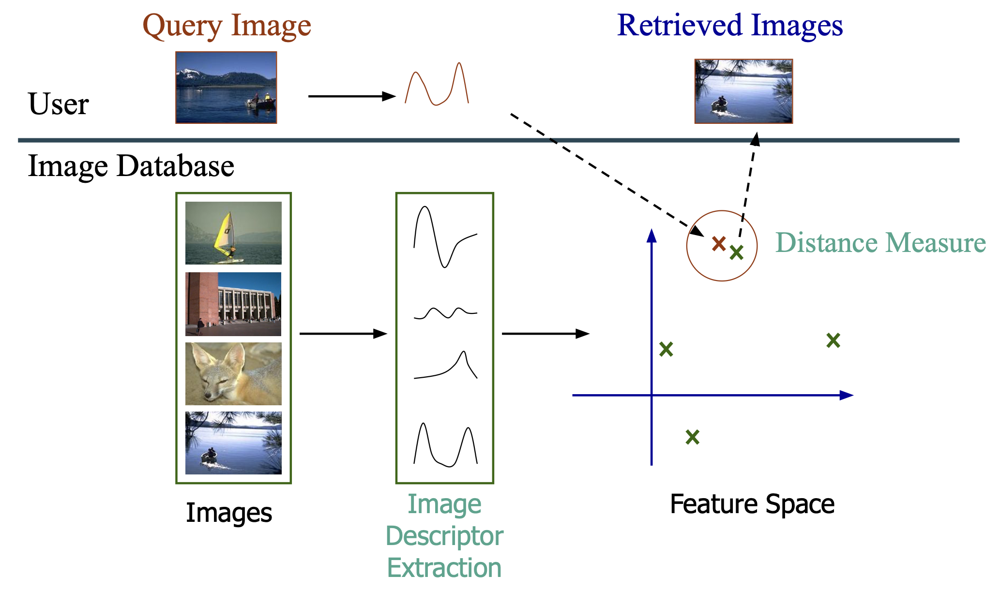
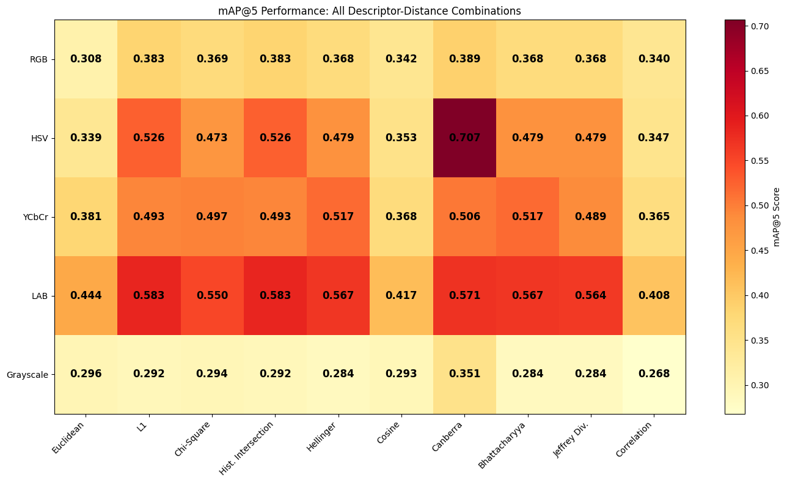
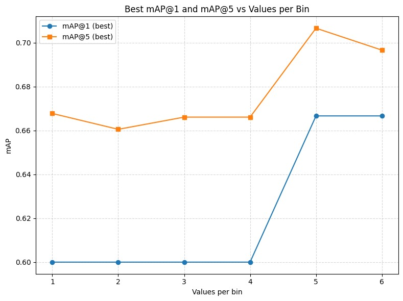

# Content-Based Image Retrieval

This project implements a **query-by-example image retrieval system** designed to find paintings in the *Can Framis Museum*, *Figueres 120 years ago* and *Kode Bergen* image collection based on their **visual content**.  

Developed by **Team 5** as part of the **C1 - Content Based Image Retrieval** course assignment at the *Master’s in Computer Vision (UPC-CVC)*, academic year 2025-2026.


## Overview
This project implements a Content-Based Image Retrieval system designed to search paintings in the museums dataset based on color, texture, and local descriptors.
The goal is to explore classical and modern feature extraction techniques for visual similarity search.

The following diagram illustrates the CBIR workflow implemented in this project.
<p align="center">  </p>

To learn more about the experimentation process and the choice of optimal parameters, see the [Methodology](#methodology) section.


## Pipeline steps:

1. **Indexing the database.** Compute and store color histograms for all database images (performed offline).

2. **Noise detection and removal.** Detects noisy images by measuring  intensity fluctuations, and if detected, removes the noise.

3. **Background removal.** Use color to remove the background of the query images.

4. **Feature extraction for query images.** Compute the same descriptor type used for the database for each query image only on the foreground pixels.

5. **Similarity computation.** Compare query descriptors with the database using distance metrics.

6. **Ranking and retrieval.** Sort database images according to similarity and return the top-k most visually similar paintings.

## Features

- **Noise detection and removal:** Detects noisy images by measuring local intensity fluctuations. And if detected, replaces each pixel value using its neighborhood context to remove it.

  **Noise detection methods:**
  - Laplacian filter
  - Gradient difference
  - Wavelet transform
  - FFT-based method

  **Noise removal methods:**
  - Gaussian filter
  - Median filter
  - Wavelet decomposition

- **Background Removal:** Automatically segments the painting from its background using robust color statistics and morphological filtering. 

- **Multiple Image Descriptors:** Extract diverse visual representations capturing color, texture, and spatial information.  
  
- **Multiple Image Descriptors:** Extract diverse visual representations capturing color, texture, spatial, and keypoint-based information.  

  **Global descriptors:**  
  Capture overall image statistics or structure, producing one descriptor per image.

  - **Color-based descriptors:**
    - Grayscale Histogram  
    - RGB Histogram  
    - HSV Histogram  
    - YCbCr Histogram  
    - LAB Histogram  
    - 2 Dimension Histogram  
    - 3 Dimension Histogram  
    - Block-based Histogram  
    - Spatial Pyramid Histogram  

  - **Texture-based descriptors:**
    - DCT (Discrete Cosine Transform)  
    - LBP (Local Binary Patterns)  
    - Wavelet Transform (DWT)  

  **Local descriptors:**  
  Capture distinctive image regions and their local structures for keypoint-based matching and retrieval.

  - **Keypoint detectors:**
    - DoG (Difference of Gaussians)  
    - Harris  
    - Harris-Laplacian  

  - **Feature descriptors:**
    - SIFT  
    - DAISY  
    - HOG  

- **Multiple Distance Metrics:** Measures similarity between images using diverse statistical and geometric criteria.
  - Euclidean Distance
  - L1 (Manhattan) Distance
  - Chi-Squared Distance
  - Histogram Intersection
  - Hellinger Distance
  - Cosine Distance
  - Canberra Distance
  - Bhattacharyya Distance
  - Jensen-Shannon Divergence
  - Correlation Distance

- **Evaluation Metrics:** Quantifies retrieval effectiveness and ranking quality.  
  - Mean Average Precision at K (mAP@K)
  - Top-K retrieval accuracy

- **Visualization:** Provides intuitive insight into system performance and retrieval quality.
  - Heatmaps for comprehensive evaluation
  - Query-retrieval result visualizations
  - Matches between queries and predicted retrieves

## Project Organization

The project follows a modular and reproducible structure, inspired by the cookiecutter data science template. Each folder has a clear purpose to ensure scalability and team collaboration.

```
├── Makefile           <- Makefile with convenience commands
├── README.md          <- The top-level README for developers using this project.
├── data
│   ├── raw            <- The original, immutable data dump.
│   ├── segmented      <- The segmented dataset after applying background removal.
│   ├── descriptors    <- Descriptors extracted from images ready to use for retrieval.
│   └── results        <- Results obtained from executing the retrieval.
│
├── models             <- Trained and serialized models, model predictions, or model summaries
│
├── notebooks/         <- Jupyter notebooks.
│
├── reports            <- Generated analysis as HTML, PDF, LaTeX, etc.
│   └── figures        <- Generated graphics and figures to be used in reporting
│
├── requirements.txt   <- The requirements file for reproducing the analysis environment, e.g.
│
└── src   <- Source code for use in this project.
    ├── __init__.py             <- Makes src a Python module
    ├── config.py               <- Store useful variables and configuration
    ├── data/                   <- Scripts to extract/load data
    ├── descriptors/            <- Scripts to compute image descriptors
    ├── distances/              <- Scripts to compute distance measures
    ├── metrics/                <- Scripts to compute metrics
    ├── models/                 <- Scripts to compute image retrieval and generate deliverables
    ├── tools/                  <- Helper functions
    └── visualization/          <- Code to create visualizations
```

--------

## Installation

#### Clone the repository
``` bash
git clone https://github.com/MCV-2025-C1-Project/Team5.git
cd Team5
```

#### Create and activate virtual environment
It’s recommended to use a virtual environment to avoid dependency conflicts.
```bash
python -m venv .venv
source .venv/bin/activate
```

#### Install dependencies
```bash
pip install -r requirements.txt
```

#### Add dataset files

Place the datasets in the `data/raw/` folder as follows:
```
├── data
    └── raw
        ├──BBDD/            <- Database of paintings
        ├──qsd1_w1/         <- Query set for week 1 development
        ├──qsd2_w2/         <- Query set for week 2 development
        ├──...
        ├──qst1_w1/         <- Query set for week 1 testing
        ├──qst_w2/          <- Query set for week 2 testing
        └──...
```


## Usage

Once the environment and data are set up, you can execute the pipeline to perform image retrieval.


### 1. Remove background

<!---#### To execute manually--->

The background segmentation module removes non-artwork regions using robust color-based analysis in LAB and HSV spaces, isolating the painting for cleaner descriptor extraction and retrieval. Additionally, it includes an automatic **noise detection and removal step**:
- Noise is detected using the **Laplacian filter**, which identifies images with strong local intensity variations.
- If noise is present, it is removed using a **Median filter**, which effectively smooths the image while preserving edges and fine details.

**Example command**

```bash
python -m src.models.seg
```

This command processes all images in the default dataset folder, producing:
- Binary foreground masks
- Segmented (background-removed) images
- Visualizations and performance metrics (if ground truth is available)
- Outputs are stored under `data/segmented/`.

| Parameter | Description |
|------------|-------------|
| `--image_folder` | Path to the input dataset folder (default: `data/raw/qsd2_w2/`). |
| `--output_folder` | Directory where segmented images, masks, and visualizations will be saved (default: `data/segmented/`). |
| `--max_images` | Maximum number of images to process (optional; processes all by default). |

Run `python -m src.models.seg --help` to see all available options.


### 2. Run the full pipeline

The retrieval system can be executed end-to-end using the `run` module, which performs **feature extraction**, **image retrieval**, and **evaluation** in a single step.

This module automatically loads the museum and query images, computes the selected descriptors, compares them using the specified distance metric, ranks the top-K most similar results, and evaluates the performance against the provided ground truth.

**Workflow**


1. **Load datasets** — both query and museum images are read from their respective folders.  
   If the descriptors for the dataset have already been computed in a previous run, they are automatically **loaded from their serialized `.pkl` files** instead of being recomputed, saving time and ensuring reproducibility.  

2. **Feature extraction** — descriptors are generated for each image according to the selected descriptor type and mode (`global` or `local`).  
   Multiple combinations of descriptors and distance metrics can be evaluated within the same run; the system automatically selects and stores the configuration that achieves the **highest mAP score**.  

3. **Similarity computation** — each query descriptor is compared with all museum descriptors using the chosen distance metric.  

4. **Ranking** — the system retrieves and ranks the top-*K* most visually similar paintings for each query image.  

5. **Evaluation** — performance is measured using **mAP@K** and **Top-K accuracy** metrics, allowing comparison between different descriptor–distance configurations.  

6. **Result saving and visualization** —  
   For the best-performing configuration, the system automatically:
   - **Generates and saves** a `.pkl` file containing the ranked retrieval results (one list of retrieved image indices per query).  
   - **Creates visualizations** that include:
     - Global **heatmaps** summarizing descriptor and distance performance.  
     - **Query–retrieval samples** showing the most similar results for representative queries.  
     - **Local matches visualization** (for `mode local`) highlighting detected keypoints and their correspondences between the query and retrieved images.   

**Feature extraction modes**

The system supports two types of feature extraction strategies, specified using the `--mode` argument:

| Mode | Description |
|------|--------------|
| `global` | Computes a single descriptor per image, summarizing its overall color, texture, or structure. Used for color histograms, texture descriptors, etc. |
| `local` | Extracts keypoints and computes descriptors locally around them (e.g., SIFT, DAISY, or HOG), enabling fine-grained image matching. |

**Example commands**

To evaluate on the **1st week dataset** (global descriptors):

```bash
python -m src.models.run \
    --mode global
    --query_dir data/raw/qsd1_w1 \
    --museum_dir data/raw/BBDD \
    --ground_truth data/raw/qsd1_w1/gt_corresps.pkl \
    --values_per_bin 5 \
    --output_dir results/w1 \
    --k 5 \
    --descriptors hsv \
    --distances canberra.canberra_distance \
```   

To evaluate on the **2st week dataset** (global descriptors):

```bash
python -m src.models.run \
    --mode global
    --query_dir data/raw/qsd1_w2 \
    --museum_dir data/raw/BBDD \
    --ground_truth data/raw/qsd1_w2/gt_corresps.pkl \
    --values_per_bin 8 \
    --output_dir results/w2 \
    --k 5 \
    --descriptors spatial_pyramid_hsv_lvl4 \
    --distances canberra.canberra_distance \
```   
    
To evaluate on the **3st week dataset** (global descriptors):

```bash
python -m src.models.run \
    --mode global
    --query_dir data/raw/qsd1_w3 \
    --museum_dir data/raw/BBDD \
    --ground_truth data/raw/qsd1_w3/gt_corresps.pkl \
    --output_dir results/w3 \
    --k 5 \
    --descriptors dct_lab_4x4_16coeffs \
    --distances canberra.canberra_distance \
```  

To evaluate on the **4st week dataset** (local descriptors):

```bash
python -m src.models.run \
    --mode local
    --query_dir data/raw/qsd1_w4 \
    --museum_dir data/raw/BBDD \
    --ground_truth data/raw/qsd1_w4/gt_corresps.pkl \
    --output_dir results/w4 \
    --k 5 \
    --descriptors sift_dog_default \
    --distances l1.compute_l1_distance \
```  

## Methodology

### Week 1

The first milestone focuses on global color-based image retrieval, using single-resolution color histograms as visual descriptors. Color histograms are one of the simplest and most intuitive ways to represent an image, summarizing the distribution of pixel colors and enabling comparisons through distance metrics

The first week we computed and tested different 1D histogram-based descriptors by systematically varying the colour space and the bin resolution, and compared these combinations to identify the most discriminative representation for accurate similarity and retrieval in later tasks.

Another goal was to measure and quantify the similarity between images by comparing their feature descriptors using a variety of distance and similarity metrics. And we did that by computing different similarity/distance measures on image descriptors, and systematically evaluate their behavior to identify which metrics best capture perceptual similarity

We performed a grid search experimentation combining 5 different color spaces histograms as descriptors: grayscale, concatenated RGB, concatenated HSV, concatenated LAB, and concatenated YCbCr; a range of different values for the bin size starting from one bin for each value and increasing it; and 10 different distances: Euclidean, L1, Chi-squared, Cosine, Hellinger, Correlatino, Canberra, Bhattacharyya, Histogram intersection, and Jensen-Shannon divergence. 

For each descriptor/bin setting, we computed distances between each query image and all images in the BBDD with all candidate metrics. And for each descriptor/bin/metric combination, we computed retrieval metrics such as mAP@1 and mAP@5 on the query set (QSD1 vs. BBDD), compared with the provided ground truths, and visualised the results with heatmaps per bin setting.

That way we found that the best performing bin size is 52, the best descriptors are the LAB and HSV concatenated histograms, and the best performing distance is the Canberra.

<p align="center">   </p>

> 💡 Detailed experiments results can be found [here](https://drive.google.com/file/d/1xAyKrl3MnFGKuZpDm2FUu5bInHqnu2BU/view?usp=sharing)

### Week 2

During the second week of the project, we had 2 goals. From one hand, **enhancing image representation by combining color and spatial information**, creating more discriminative descriptors for image retrieval. We extended the classic color histogram approach by computing histograms not only over the whole image, but also over spatial regions and multiple pyramid levels. From the other hand, we wanted to **use color to remove the background of the images** to be able to compute the descriptors only on the foreground pixels.

#### Improving descriptors

To evaluate how color representation and spatial structure influence retrieval performance, we tested a variety of histogram descriptors in the HSV color space using the Canberra distance, as these were the best performing parameters selected from week 1. We explored 1D, 2D, and 3D histograms with increasing color dimensionality, and extended them with block-based and spatial pyramid variants to capture local and multi-scale information. For each setup, we experimented with different bin sizes, grid divisions, and pyramid levels to study the trade-off between descriptor detail and computational efficiency.

The best overall performance was achieved with the Spatial Pyramid Histogram (1D, HSV) using Level 4 and 32 bins, reaching
mAP@1 = 0.833 and mAP@5 = 0.883.

In contrast, 2D histograms (H-S) performed significantly worse — the best result (~0.50 mAP@5 with 16×16 bins) was even lower than our Week 1 baseline (mAP@1 = 0.667, mAP@5 = 0.707).
This suggests that removing the Value (V) channel discarded important brightness information that helps distinguish similar colors.

For 3D histograms, results did not surpass the 1D spatial pyramid either, although the 3D pyramid (Level 3) reached a moderate mAP@5 = 0.72.
We expected these descriptors (hierarchical vs. 3D) to perform better since they capture richer color relationships, but the higher dimensionality may have caused over-smoothing and loss of discriminative power, especially with limited data.

#### Removing background

The background removal module isolates the painting from its surroundings using robust color statistics in the LAB and HSV color spaces. The algorithm first estimates the background color by analyzing the image borders in LAB space, computing a robust median and deviation per channel. Each pixel’s distance to this background model is then calculated and thresholded adaptively based on the distribution of border distances. Pixels that deviate significantly from the background in color are classified as foreground.  

A hue-based fallback in HSV space detects additional foreground pixels whose hue differs strongly from the background, improving robustness to illumination changes. Finally, a sequence of morphological operations removes small artifacts, fills holes, and retains the main object region. The resulting binary mask is applied to the original image to produce a clean segmentation of the painting. Evaluating the generating masks with their ground truths pixel-wise, we obtained a precision of 0.94, a recall of 0.93 and an F1-score of 0.92.

#### Final pipeline

We built the final pipeline combining the background removal and used the best configuration for retrieval: 4-Level HSV Spatial Pyramid Histogram with 32 bins as a descriptor with Canberra distance.

We observed that background removal is generally successful, but leaves minor noise at painting borders. This segmentation noise leads to incorrect matches, degrading the metrics compared to the non-segmented version with the 1st dataset. Nonetheless, we reached a mAP@1 of 0.6667 and a mAP@5 of 0.7333.
 

### Week 3

#### Noise detection and removal

In this task, we addressed the problem of detecting and removing noise from a dataset containing both clean and noisy images with unknown characteristics. Since most noise is concentrated in the luminance component, all experiments were carried out in the YCbCr color space, focusing on the Y channel. We evaluated several noise detection approaches: Laplacian filter, gradient difference, wavelet transform, and FFT-based method to identify which images were affected. The Laplacian filter achieved the most stable and accurate results across different noise types.

After detection, we applied three denoising techniques: Gaussian, median, and wavelet-based filters. Their hyperparameters were optimized through grid search using PSNR and SSIM as evaluation metrics. Results showed that applying denoising selectively on noisy images improved overall quality, with the median filter providing the best trade-off between noise reduction and edge preservation.

To run the segmentation for multiple paintings per image run:

```bash
python -m src.models.seg --image_folder /path/to/images --output_folder /path/to.outputs --multi_painting
```


#### Texture descriptors

We implemented and evaluated three texture descriptors — DCT, LBP, and DWT — to capture structural and textural information from paintings. Each method was tested under different conditions, varying color space (Grayscale, LAB, HSV), spatial detail (4×4 vs 8×8 grids), and descriptor complexity (number of coefficients, scales, or decomposition levels). All experiments were conducted on both the original and denoised datasets to assess robustness to noise. 

The DCT descriptor captured low-frequency patterns within image blocks through a zigzag scan of DCT coefficients. It achieved the best results with DCT_LAB_4×4_16Coeffs + Canberra distance, reaching mAP@1 = 1.00 on both noisy and denoised images, showing excellent discriminative power and stability, especially in LAB and Grayscale spaces. 

The LBP descriptor encoded local micro-patterns using binary comparisons of neighboring pixels, with performance improving for higher complexity (multi-scale and finer grids). The best configuration, LBP_LAB_MS2_8×8, reached mAP@1 = 0.60, but slightly decreased to 0.57 after denoising, suggesting that noise removal also smoothed the fine texture details crucial to LBP. 

Finally, the DWT descriptor combined spatial and frequency analysis through multi-scale wavelet decomposition. The block-based version preserved spatial information and clearly outperformed the global one. Its best configuration, Block_Haar_Grayscale_8×8_LVL1 + Euclidean distance, achieved mAP@1 = 1.00 even after denoising, confirming strong robustness to both noise and color variations. 

Overall, DCT and DWT reached perfect accuracy, while DWT proved the most stable under all conditions, and LBP, although effective, remained more sensitive to smoothing and noise.

## Team members:

- OREGI LAUZIRIKA, Lore - loreoregi@gmail.com
- ROSELL MURILLO, Marina - marrosmur@gmail.com
- ARTERO PONS, Marc - marteropons@gmail.com
- PURKAYASTHA, Kunal - kunalpurkayastha09@gmail.com
